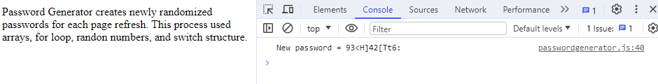

# Password_Generator
JavaScript project that generates a randomized 12 character long password after each webpage refresh.

## About JavaScript File
**Four arrays:**
+ Uppercase Letters
+ Lowercase Letters
+ Numbers
+ NonAlphanumeric / Special Characters

**Global Declaration**
+ `let passgene = '';`
  - empty string to assign values to within for loop
+ `let passlength = 12;`
  - variable for password length used in for loop

**for loop runs until *i* equals to `passlength`**
+ `let x = Math.floor(Math.random() * 4 + 1);` generates a ranmdom number 1 through 4
   - This random number is used to select a switch case.
+ Nested switch statement
  - There are 4 individual cases, one for each array 
  -  That case generates another random number used to index respective array.
  - The results are assigned the value of that indexed array.
  - `passgene` concatenates / adds the resulting value to the string.
  - `break` allows to "break" out of the case if it first initail random number doesn't match.

**`console.log(`New password = ${passgene}`);` prints the final result from the for loop.**

## Instructions for Password_Generator
+ [Open Password_Generator](https://matthewbray88.github.io/Password_Generator/)
+ Press *F12* to open the dev tools showing the console, **this is the result of Password_Generator**.
+ To generate another password press *Ctrl + r*

## Example
